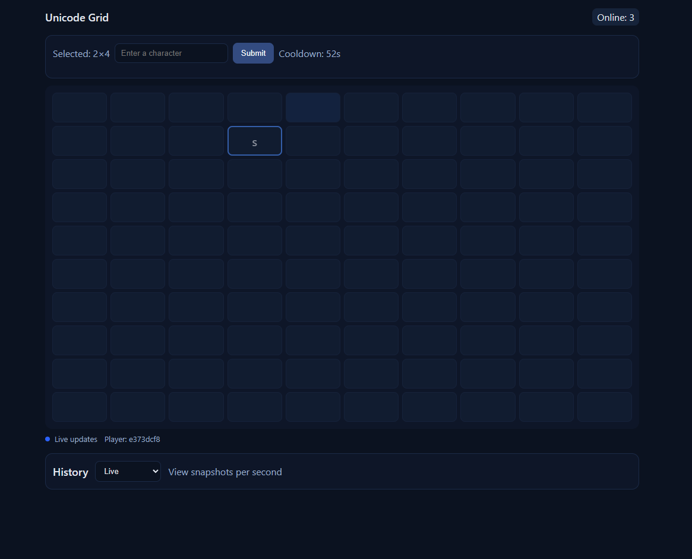

# Unicode Grid 


- **Realtime**: Shared 10×10 grid via Socket.IO
- **Rule**: One submission per player by default (optional cooldown)
- **Online Count**: See how many players are connected
- **History**: View snapshots grouped by second

## Run locally

### 1) Server

```sh
cd server
copy .env.example .env
npm install
npm run dev
```

.env contains the cooldown timer which can be chnaged accoring to user likings

### 2) Client

```sh
cd client
npm install
npm run dev
```


## Notes

- Every player gets a persistent `playerId` stored in `localStorage`.
- Server enforces the one-move/cooldown rule; client UI disables accordingly.
- History panel lets you time-travel per-second snapshots.

